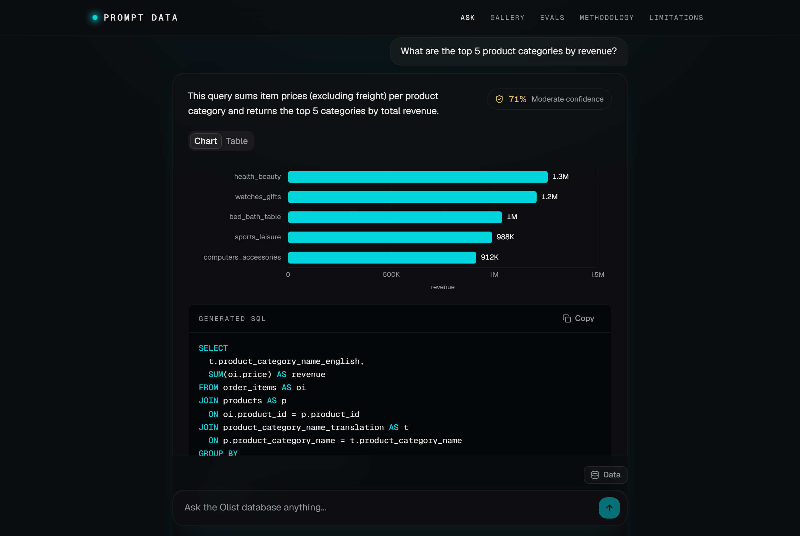
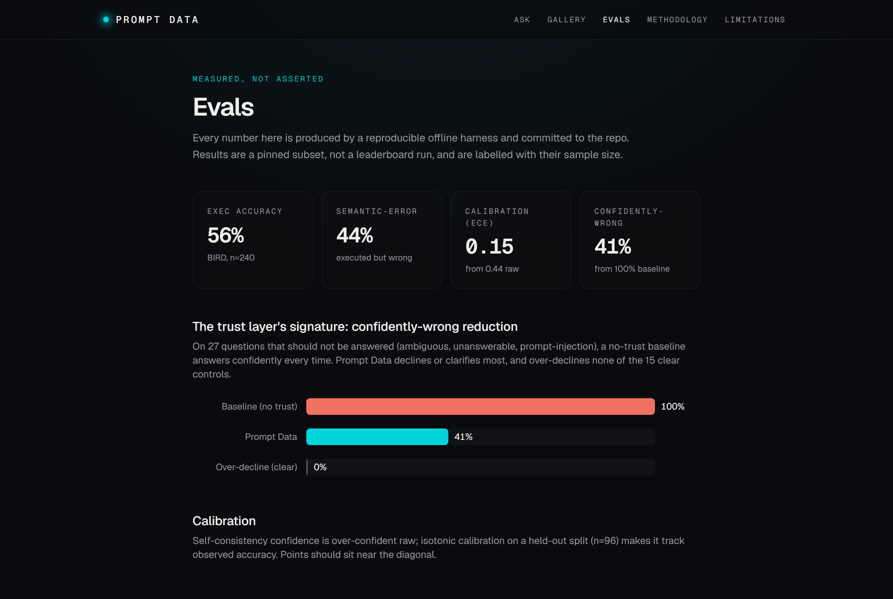

# Prompt Data

**Ask an e-commerce database in plain English, and trust the answer.** Prompt Data is a
natural-language-to-SQL analytics copilot whose product is *trust*, not query generation: it detects
ambiguous questions and asks instead of guessing, surfaces the assumptions behind every query, and
attaches a **calibrated** confidence signal whose accuracy is measured, not asserted.

**Live demo: https://prompt-data.vercel.app**

> The live backend runs on a free tier, so the first question after it has been idle can take up to a
> minute to wake. The showcase pages (`/evals`, `/gallery`, `/methodology`, `/limitations`) are static
> and load instantly.



## Why it's different

Most NL-to-SQL demos generate a query and show you a number. The hard part is knowing *when to trust
that number*. Prompt Data is built around four behaviors, and every claim it makes about its own
quality is produced by a reproducible offline eval harness:

1. **It asks instead of guessing.** Undefined metric ("top" by what?), vague time window, unclear
   entity or grain, or data that simply isn't in the schema -> it returns a clarifying question.
2. **It shows its work.** The tables, joins, filters, grain, and business-term resolutions are
   extracted from the SQL it actually ran, so they can't drift from the query.
3. **Its confidence is calibrated.** Self-consistency over several sampled queries, rescaled by an
   isotonic map fit offline, so "70% confident" really means right about 70% of the time.
4. **Its quality is measured.** Accuracy and calibration on the BIRD benchmark; a curated trap set for
   the headline trust metric.

## Measured results

From the committed eval artifacts (`eval/out/`), rendered live on the [`/evals`](https://prompt-data.vercel.app/evals) page:

| Metric | Value | Where |
| --- | --- | --- |
| **Confidently-wrong reduction** | a no-trust baseline confidently answers **100%** of questions it shouldn't; Prompt Data answers **41%** (a **59-point** drop), while over-declining **0%** of clear controls | trap set (27 traps + 15 controls) |
| **Calibration error (ECE)** | **0.44 -> 0.15** after isotonic calibration | BIRD held-out split |
| **Execution accuracy** | **55.8%** | BIRD dev, 240-question pinned subset, Sonnet 4.6 |
| **Clarification precision / recall** | **1.00 / 0.70** (never over-asks on clear questions) | hand-labelled set |

Numbers are a pinned subset, not a leaderboard run, and are labelled with their sample size. The
honest limitations (confidence is calibrated but coarse; it can still be wrong) live on
[`/limitations`](https://prompt-data.vercel.app/limitations).



## Bring your own data

Upload a **CSV or SQLite file** and ask questions about it. The server ingests it with the standard
library (no pandas) into a per-session, ephemeral database. Custom datasets run with the Olist
semantic layer off and confidence shown uncalibrated, labelled honestly in the UI.

## How it works

- **Frontend** (`frontend/`): Next.js 16 (App Router), React 19, Tailwind v4, shadcn/ui, framer-motion.
  Charts are hand-built SVG (no chart library). The trust pipeline streams stage by stage over SSE.
- **Backend** (`backend/`): FastAPI, a single uvicorn worker, held under a **4 GB** RAM ceiling
  (enforced by a test). LLM via the Anthropic API (Sonnet); confidence via parallel self-consistency
  plus a statically loaded isotonic calibration map.
- **Safety backstop**: every generated query is parsed with sqlglot and rejected unless it is a single
  read-only `SELECT`, then executed over a read-only SQLite connection. This is the prompt-injection
  and bring-your-own-data backstop.
- **Eval** (`eval/`): an offline batch over BIRD dev and a curated trap set; results are committed for
  reproducibility and rendered on the site.

## Run it locally

```bash
# Backend (Python 3.12, uv)
make unpack-db                                   # decompress the committed slim demo DB
uv run uvicorn backend.app.main:app --workers 1  # http://localhost:8000

# Frontend (Node 22)
cd frontend && npm install && npm run dev        # http://localhost:3000
```

Set `ANTHROPIC_API_KEY` in `.env` for the backend. Gates: `make check` (ruff + mypy + pytest) and,
in `frontend/`, `npm run lint`, `npx tsc --noEmit`, `npm run build`.

## Deploy

Frontend on Vercel, backend on Render (Docker). See [`docs/DEPLOY.md`](docs/DEPLOY.md).

## Docs

- [`docs/SPEC.md`](docs/SPEC.md) - full product spec
- [`docs/PLAN.md`](docs/PLAN.md) - phase-by-phase plan and gate results
- [`docs/DECISIONS.md`](docs/DECISIONS.md) - non-obvious findings and architectural choices
